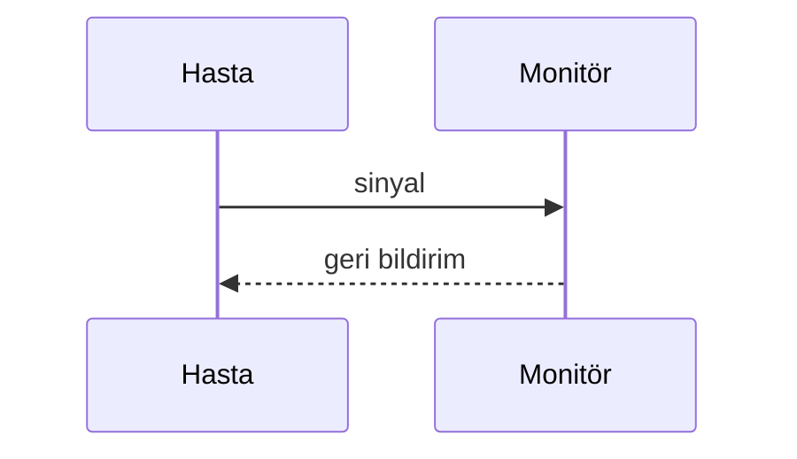

# Blog yazısı özellikleri — hızlı referans

al-folio temasının desteklediği özellikler ve nasıl kullanılacakları. Bu dosya,
depodan kaldırılan 24 demo yazının ("a post with …") içerdiği bilgiyi özetler.

Demo yazıların tam hâli her zaman kaynak temada duruyor:
<https://github.com/alshedivat/al-folio/tree/master/_posts>

---

## Front matter alanları

Her yazı `_posts/YYYY-MM-DD-slug.md` adıyla oluşturulur ve şu blokla başlar:

```yaml
---
layout: post
title: yazı başlığı
date: 2026-01-15 16:40:16
description: liste sayfasında görünen kısa açıklama
tags: formatting images # boşlukla ayrılır
categories: sample-posts # boşlukla ayrılır, alt kategori olabilir
---
```

Kullanılabilir ek alanlar:

| Alan                                       | Değer              | Ne yapar                                                                    |
| ------------------------------------------ | ------------------ | --------------------------------------------------------------------------- |
| `featured`                                 | `true`             | Yazıyı blog sayfasının üstünde öne çıkarır                                  |
| `thumbnail`                                | `assets/img/9.jpg` | Liste görünümünde küçük resim                                               |
| `related_posts`                            | `false`            | Alttaki "ilgili yazılar" bölümünü gizler                                    |
| `toc: {sidebar: left}`                     | —                  | Yan tarafta içindekiler (sağ için `right`)                                  |
| `toc: {beginning: true}`                   | —                  | İçindekiler'i yazının başına koyar                                          |
| `redirect`                                 | URL veya yol       | Yazıyı açanı başka adrese yönlendirir                                       |
| `giscus_comments`                          | `true`             | GitHub Discussions tabanlı yorumlar (`_config.yml`'de giscus ayarlı olmalı) |
| `disqus_comments`                          | `true`             | Disqus yorumları (`disqus_shortname` gerekir)                               |
| `mermaid: {enabled: true, zoomable: true}` | —                  | Mermaid diyagramlarını etkinleştirir                                        |
| `chart: {chartjs: true}`                   | —                  | Chart.js grafiklerini etkinleştirir                                         |
| `chart: {echarts: true}`                   | —                  | ECharts grafiklerini etkinleştirir                                          |
| `chart: {vega_lite: true}`                 | —                  | Vega-Lite grafiklerini etkinleştirir                                        |
| `map: true`                                | `true`             | Leaflet harita desteği                                                      |
| `code_diff: true`                          | `true`             | Kod diff görüntüleyici                                                      |
| `tikzjax: true`                            | `true`             | TikZ çizimleri                                                              |
| `pretty_table: true`                       | `true`             | Bootstrap Tables ile sıralanabilir/aranabilir tablolar                      |
| `images: {compare: true, slider: true}`    | —                  | Karşılaştırmalı görsel kaydırıcısı                                          |

---

## Görseller

```liquid

```

Tıklayınca büyüyen görsel için `zoomable=true` ekleyin:

```liquid

```

Bootstrap ızgarasıyla yan yana:

```liquid
<div class="row mt-3">
  <div class="col-sm mt-3 mt-md-0">
    
  </div>
  <div class="col-sm mt-3 mt-md-0">
    
  </div>
</div>
<div class="caption">Görsellerin altına gelen açıklama.</div>
```

> **Not:** `jekyll-imagemagick` her `.jpg`/`.png` için responsive `.webp` türevleri
> üretir. `assets/img/` içine koyduğunuz her görsel otomatik işlenir; başka klasöre
> koyarsanız türev üretilmez ve link denetimi kırık bağlantı bildirir.

---

## Video ve ses

```liquid



```

---

## Matematik

Satır içi: `$$E = mc^2$$` — paragraf içinde kullanılır.

Ayrı satırda:

```markdown
$$
\left( \sum_{k=1}^n a_k b_k \right)^2 \leq \left( \sum_{k=1}^n a_k^2 \right) \left( \sum_{k=1}^n b_k^2 \right)
$$
```

MathJax 3 kullanılıyor. Alt çizgi içeren ifadelerde kramdown'ın italik yapmasını
önlemek için `\_` yazın veya ifadeyi `$$…$$` içine alın.

---

## Kod

Satır numaralı, vurgulu blok:

```markdown

int main(void) {
printf("hello\n");
return 0;
}

```

Normal markdown kod bloğu da çalışır:

````markdown
```python
import numpy as np
```
````

Kod diff'i için front matter'a `code_diff: true` ekleyip:

````markdown
```diff
- eski satır
+ yeni satır
```
````

---

## Diyagramlar (Mermaid)

Front matter'a `mermaid: {enabled: true, zoomable: true}` ekleyin, sonra:

````markdown

````

---

## Tablolar

`pretty_table: true` ile Bootstrap Tables:

```html
<table data-toggle="table" data-sortable="true" data-search="true" data-pagination="true">
  <thead>
    <tr>
      <th data-sortable="true">Ölçüm</th>
      <th data-sortable="true">Değer</th>
    </tr>
  </thead>
  <tbody>
    <tr>
      <td>FID</td>
      <td>77.78</td>
    </tr>
  </tbody>
</table>
```

---

## Alıntı kutuları

```markdown
> Normal alıntı.

{: .block-tip }

> **İpucu**
>
> Yeşil bilgi kutusu.
```

Kullanılabilir sınıflar: `.block-tip`, `.block-warning`, `.block-danger`.

---

## Kaynakça

Yazıya özel kaynakça için front matter'a:

```yaml
related_publications: true
```

Metin içinde atıf: `` — anahtar
`_bibliography/papers.bib` dosyasındaki girdiden gelir.

---

## Jupyter defteri gömme

Defteri `assets/jupyter/` altına koyun, sonra:

```liquid
{::nomarkdown}



  

  <p>Defter bulunamadı.</p>

{:/nomarkdown}
```

---

## Grafikler

Chart.js (`chart: {chartjs: true}`), ECharts (`chart: {echarts: true}`) ve
Vega-Lite (`chart: {vega_lite: true}`) destekleniyor. Her biri için ilgili
` ```chartjs `, ` ```echarts `, ` ```vega_lite ` bloğunun
içine JSON tanımı yazılır. Ayrıntı için kaynak temadaki demo yazılara bakın.
